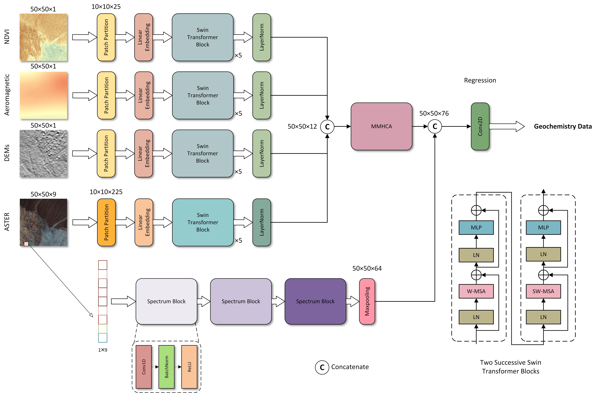

# <center>High-Resolution Geochemical Data Mapping With Swin Transformer-Convolution-Based Multi-Source Geoscience Data Fusion

## Quick View


## Usage
### Perpare
- **Python environment**  
You need to install the following libraries: *pytorch, timm, gdal, numpy, pandas, sklearn, scipy, tqdm*.
```bash
conda create -n mssf_scr python=3.10

# Recommend installing according to the official PyTorch method.(Don't use the following)
conda install pytorch=2.1

conda imstall timm=0.9.16
```

- **Training data**  
Use the *trainData_prepare* file in the tool folder to automatically generate the required training files. If there is no patch shapefile, run *patch_prepare* first (a CSV file with coordinate information is required).

## Contact
If you find this resource helpful, please consider to star this repository and cite our research.  
Coming Soon